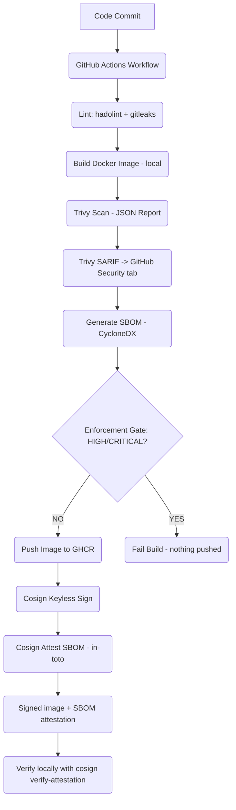

# Secure Software Supply Chain Lab

This project demonstrates a production-oriented DevSecOps pipeline focused on securing the software supply chain from source code to container registry. It integrates automated vulnerability scanning, Software Bill of Materials (SBOM) generation, policy enforcement, and keyless image signing to build trust and integrity into software artifacts, protecting against modern supply chain attacks.

## Status


## Architecture Overview

A visual representation of the secure CI/CD pipeline, detailing each stage from code commit to artifact verification.



## What This Demonstrates

This repository showcases practical application of several critical DevSecOps and supply chain security concepts:

*   **Automated Vulnerability Scanning:** Proactive identification of software vulnerabilities using Trivy.
*   **Software Bill of Materials (SBOM):** Generation and management of CycloneDX-formatted SBOMs for enhanced transparency and risk management.
*   **Policy-as-Code Enforcement:** Implementing gates in the CI/CD pipeline to prevent the deployment of insecure artifacts.
*   **Keyless Container Image Signing:** Leveraging Sigstore and Cosign with GitHub OIDC for secure, auditable, and ephemeral image attestations.
*   **Supply Chain Levels for Software Artifacts (SLSA):** Adherence to foundational SLSA principles to improve software supply chain integrity.
*   **Defense-in-Depth:** Layering security controls throughout the CI/CD process to create robust protections.
*   **Secure Containerization:** Building minimal, non-root Docker images for Go applications.

## Pipeline at a Glance

Each stage in the CI/CD pipeline serves a specific security purpose:

1.  **Build Docker Image (local):** The application is containerized into a Docker image, prepared for scanning and deployment.
    *   **Rationale:** Ensures consistent build environment and reproducible artifacts.
2.  **Trivy Scan (JSON Report):** The locally built image is scanned for vulnerabilities, and a detailed JSON report is generated.
    *   **Rationale:** Identifies security flaws early in the pipeline, preventing vulnerable images from reaching the registry. This scan does not fail the build but provides data for the enforcement gate.
3.  **Generate SBOM (CycloneDX):** A comprehensive Software Bill of Materials is created for the image.
    *   **Rationale:** Provides an immutable manifest of all components and dependencies, crucial for compliance, risk assessment, and rapid response to new CVEs.
4.  **Enforcement Gate (HIGH/CRITICAL Vulnerabilities):** The pipeline explicitly fails if Trivy detects HIGH or CRITICAL severity vulnerabilities.
    *   **Rationale:** Prevents the promotion of severely vulnerable images to the container registry, enforcing a 'shift-left' security posture.
5.  **Push Image to GHCR:** The scanned and approved image is pushed to GitHub Container Registry.
    *   **Rationale:** Utilizes a secure, versioned, and OCI-compliant registry for artifact storage. This only occurs *after* security checks pass.
6.  **Cosign Keyless Sign:** The pushed image is digitally signed using Cosign and Sigstore's keyless approach with GitHub OIDC.
    *   **Rationale:** Establishes cryptographic proof of the image's origin and integrity, allowing consumers to verify that the image has not been tampered with and originates from this specific CI/CD workflow.

## Verify It Yourself

To independently verify the security posture of an image pushed by this pipeline:

> Replace `<SHA>` below with a commit SHA from a successful workflow run on `main`.
> See the [GHCR package page](https://github.com/KatsaounisThanasis/secure-supply-chain/pkgs/container/secure-app) for available tags.

1. **Install Cosign v2:**
    ```bash
    go install github.com/sigstore/cosign/v2/cmd/cosign@latest
    # or download a release binary from https://github.com/sigstore/cosign/releases
    ```

2. **Pull the image:**
    ```bash
    docker pull ghcr.io/katsaounisthanasis/secure-app:<SHA>
    ```

3. **Verify the Cosign keyless signature:**
    ```bash
    cosign verify \
      --certificate-oidc-issuer https://token.actions.githubusercontent.com \
      --certificate-identity-regexp '^https://github.com/KatsaounisThanasis/secure-supply-chain/\.github/workflows/security\.yml@refs/heads/main$' \
      ghcr.io/katsaounisthanasis/secure-app:<SHA>
    ```
    A successful verification prints the certificate subject and Rekor transparency-log entry URL.

4. **Verify and inspect the SBOM attestation:**
    ```bash
    cosign verify-attestation \
      --type cyclonedx \
      --certificate-oidc-issuer https://token.actions.githubusercontent.com \
      --certificate-identity-regexp '^https://github.com/KatsaounisThanasis/secure-supply-chain/\.github/workflows/security\.yml@refs/heads/main$' \
      ghcr.io/katsaounisthanasis/secure-app:<SHA> \
      | jq -r '.payload' | base64 -d | jq '.predicate'
    ```
    This validates that the in-toto attestation was produced by this exact workflow and prints the embedded CycloneDX SBOM.

## Threat Model

| Threat                          | Mitigation                                                       | Where in the Pipeline   |
| :------------------------------ | :--------------------------------------------------------------- | :---------------------- |
| **Dependency CVEs**             | Trivy scan + HIGH/CRITICAL enforcement gate                      | Scan, Gate              |
| **Vulnerable base image**       | Trivy scan, version-pinned base image (digest-pin is future work)| Build, Scan             |
| **Build-time tampering**        | SHA-pinned actions, ephemeral OIDC tokens, hosted runners        | All stages              |
| **Secret leakage in source**    | gitleaks scan in lint job (gates the build)                      | Lint                    |
| **Dockerfile anti-patterns**    | hadolint                                                         | Lint                    |
| **Registry compromise / swap**  | Cosign keyless signature + Rekor transparency log                | Sign, Verify            |
| **Identity spoofing**           | `certificate-identity-regexp` pinned to this repo's workflow      | Verify                  |
| **Unsigned image at runtime**   | Kyverno `verifyImages` ClusterPolicy (Phase 5 — runtime)          | Runtime (K8s admission) |

## Tech Stack

| Category                  | Tool / Language      | Purpose                                       |
| :------------------------ | :------------------- | :-------------------------------------------- |
| **Application Language**  | Go                   | Core web service implementation               |
| **Containerization**      | Docker               | Image packaging and isolation                 |
| **CI/CD Platform**        | GitHub Actions       | Workflow automation and orchestration         |
| **Vulnerability Scanning**| Trivy (Aqua Security)| Image scanning, SBOM generation, policy engine|
| **Container Registry**    | GitHub Container Registry (GHCR) | Secure OCI artifact hosting           |
| **Image Signing**         | Cosign (Sigstore)    | Keyless digital signatures for artifacts      |
| **SBOM Standard**         | CycloneDX            | Software Bill of Materials format             |

## Local Development

The `scripts/scan.sh` script provides a local equivalent of the CI pipeline's scanning and SBOM generation steps:

```bash
./scripts/scan.sh
```

This script will:
1.  Build the Docker image locally.
2.  Run a Trivy vulnerability scan (HIGH, CRITICAL severity).
3.  Generate a CycloneDX SBOM (`sbom-local.json`).

## License

This project is licensed under the MIT License - see the LICENSE file for details.
