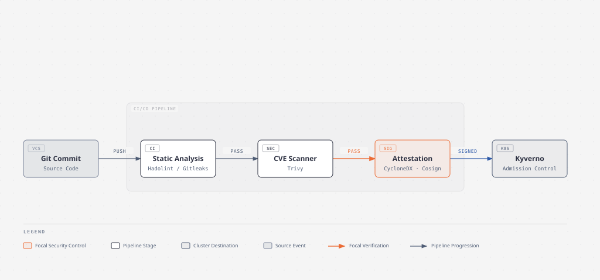
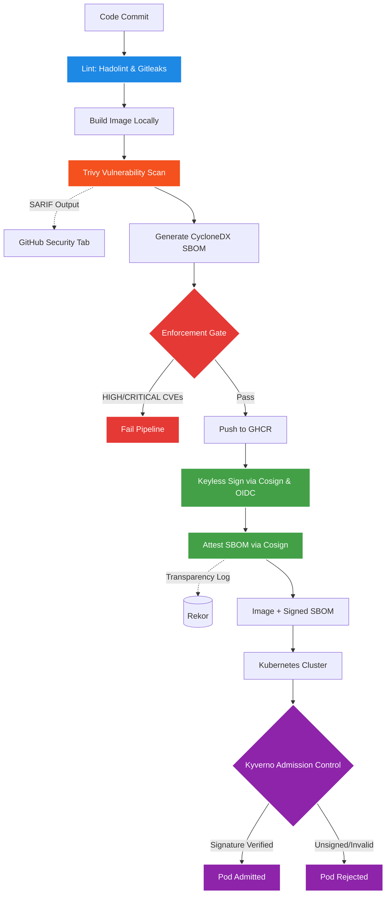
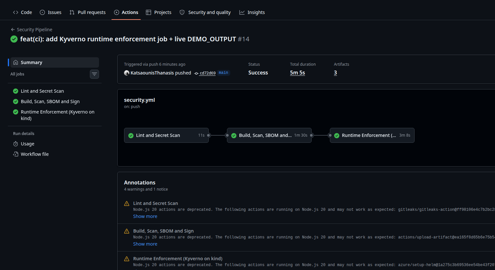
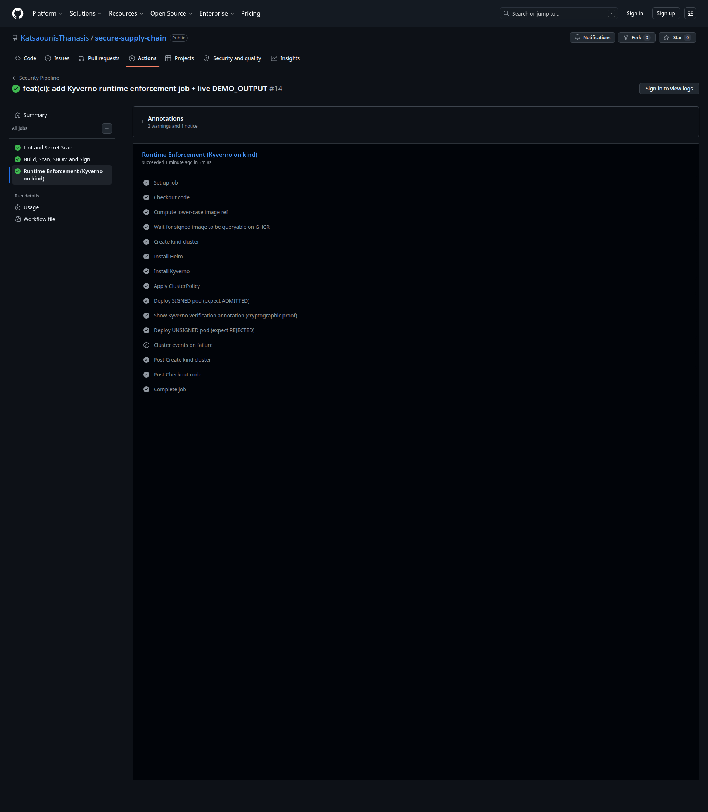
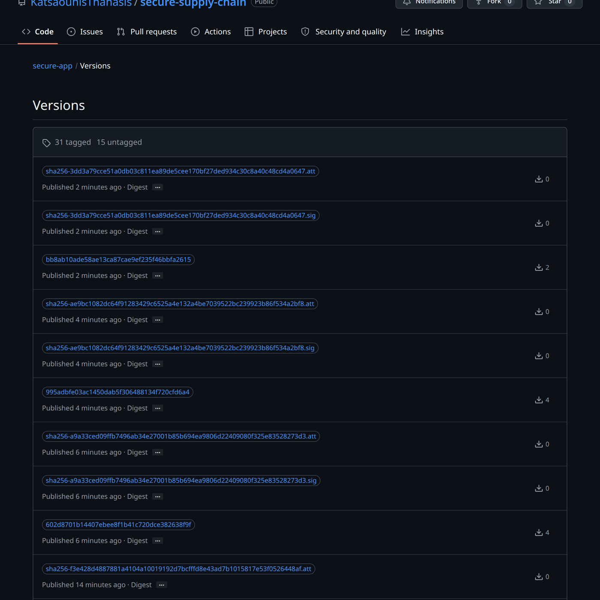

<div align="center">
  <h1>Secure Software Supply Chain 🛡️</h1>
  <p><i>A hardened, end-to-end CI/CD pipeline demonstrating zero-trust artifact integrity from commit to runtime.</i></p>

  <p>
    
    
    
  </p>
  <p>
    
    
    
    
  </p>
  <p>
    
    
    
    
  </p>
</div>



This repository is a working reference implementation of a production-grade secure software supply chain. It provides automated defense-in-depth against dependency vulnerabilities, secret leakage, and build-time tampering, culminating in cryptographic verification via Kubernetes admission control to ensure only verified, trusted artifacts run in your cluster. Every stage — from lint to admission — is self-proving on each push.

<details>
<summary>Table of Contents</summary>

- [Architecture](#architecture)
- [What This Demonstrates](#what-this-demonstrates)
- [Pipeline at a Glance](#pipeline-at-a-glance)
- [Quickstart](#quickstart)
  - [Verify a Signed Image (No Setup)](#verify-a-signed-image-no-setup)
  - [Run the Local Scan](#run-the-local-scan)
  - [Demo Runtime Enforcement (Kyverno on kind)](#demo-runtime-enforcement-kyverno-on-kind)
- [Threat Model](#threat-model)
- [Tech Stack](#tech-stack)
- [Repository Layout](#repository-layout)
- [Roadmap / Future Work](#roadmap--future-work)
- [Author](#author)
- [License](#license)

</details>

## Architecture



## What This Demonstrates

* **DevSecOps Automation:** Seamlessly integrating security into the development lifecycle without hindering deployment velocity.
* **Cryptographic Provenance:** Leveraging Sigstore's keyless signing (Fulcio) and transparency logs (Rekor) to bind CI identities to artifacts.
* **Software Bill of Materials (SBOM):** Generating and cryptographically attaching CycloneDX SBOMs via in-toto attestations.
* **Zero-Trust Runtime:** Enforcing artifact integrity at deployment time using Kubernetes admission controllers (Kyverno).
* **Shift-Left Security:** Catching exposed secrets and vulnerable dependencies before they ever reach the container registry or cluster.

## Pipeline at a Glance

1. **Code Linting (Hadolint, Gitleaks):** Analyzes Dockerfiles and repository history. *Prevents credential exposure and poor container configurations.*
2. **Local Image Build:** Compiles the application into an OCI-compliant container image. *Creates the artifact locally in an ephemeral CI environment.*
3. **Vulnerability Scanning (Trivy, JSON + SARIF):** Scans the local image for OS and application dependency CVEs. JSON goes to artifacts; SARIF feeds the GitHub Security tab. *Identifies known vulnerabilities before publication.*
4. **SBOM Generation (CycloneDX):** Creates a machine-readable inventory of all components. *Generated before the gate, so triage data exists even on failed builds.*
5. **Enforcement Gate:** Re-runs Trivy with `exit-code: 1` on HIGH/CRITICAL findings. *Halts the pipeline; nothing is pushed to GHCR.*
6. **Registry Push (GHCR):** Uploads the vetted image to the GitHub Container Registry. *Distributes only artifacts that passed the gate.*
7. **Keyless Signing (Cosign):** Signs the image using GitHub OIDC and Sigstore infrastructure. *Provides irrefutable proof of origin and prevents tampering.*
8. **Attestation (Cosign):** Attaches the SBOM to the image as an OCI referrer. *Cryptographically binds the component inventory to the specific image digest.*

## Quickstart

### Verify a Signed Image (No Setup)

You can verify the cryptographic signature and SBOM attestation of our built images using Cosign (v2.0+). Replace `<SHA>` with a specific commit or image digest.

**Verify the Image Signature:**
```bash
cosign verify \
  --certificate-identity-regexp="https://github.com/KatsaounisThanasis/secure-supply-chain/.github/workflows/security.yml@refs/heads/main" \
  --certificate-oidc-issuer="https://token.actions.githubusercontent.com" \
  ghcr.io/katsaounisthanasis/secure-app:<SHA>
```

**Verify the SBOM Attestation:**
```bash
cosign verify-attestation --type cyclonedx \
  --certificate-identity-regexp="https://github.com/KatsaounisThanasis/secure-supply-chain/.github/workflows/security.yml@refs/heads/main" \
  --certificate-oidc-issuer="https://token.actions.githubusercontent.com" \
  ghcr.io/katsaounisthanasis/secure-app:<SHA>
```

### Run the Local Scan

To validate the code locally against leaks and misconfigurations:
```bash
./scripts/scan.sh
```

### Demo Runtime Enforcement (Kyverno on kind)

This repository includes a full local demonstration of Kubernetes admission control preventing unsigned images from being deployed.

```bash
make kyverno-demo
```
*Note: This command spins up a local `kind` cluster, installs the Kyverno admission controller, applies our `verifyImages` ClusterPolicy (from `k8s/kyverno-policy.yaml`), and then attempts to deploy a signed pod (`k8s/demos/pass-signed.yaml`) which succeeds, followed by an unsigned pod (`k8s/demos/fail-unsigned.yaml`) which is rejected.*

## Live Evidence

Every claim in this README is **verifiable on the live repository** — nothing is fabricated. The pipeline is self-proving on every push.

### Pipeline run (lint → build/scan/sign → runtime enforcement) all green

<a href="https://github.com/KatsaounisThanasis/secure-supply-chain/actions/runs/25562234413">
  
</a>

> Three jobs in series. The third — **Runtime Enforcement (Kyverno on kind)** — spins up a real Kubernetes cluster inside the runner, installs Kyverno, deploys a signed pod (admitted), then deploys an unsigned pod (rejected). All asserted automatically.

### Runtime enforcement job: signed admit + unsigned reject, both proven in CI

<a href="https://github.com/KatsaounisThanasis/secure-supply-chain/actions/runs/25562234413/job/75036844700">
  
</a>

> The two key steps are `Deploy SIGNED pod (expect ADMITTED)` and `Deploy UNSIGNED pod (expect REJECTED)` — they fail the build if either expectation isn't met.

### Signed image on GitHub Container Registry

<a href="https://github.com/KatsaounisThanasis/secure-supply-chain/pkgs/container/secure-app">
  
</a>

> Each commit produces a tagged image plus `<digest>.sig` and `<digest>.att` artifacts (the Cosign signature and CycloneDX SBOM attestation).

### Verbatim text output (signature, annotation, mutated digest, reject error)

See [`docs/DEMO_OUTPUT.md`](docs/DEMO_OUTPUT.md) for the full captured terminal output of the local end-to-end run, including the cosign verification details, the Kyverno `verify-images: pass` annotation, and the admission rejection error message.

### Other live links

- **GitHub Code Scanning** (Trivy SARIF findings): [/security/code-scanning](https://github.com/KatsaounisThanasis/secure-supply-chain/security/code-scanning)
- **Sigstore Rekor transparency log entry** for `commit 55fe507`: [search.sigstore.dev?logIndex=1473402910](https://search.sigstore.dev/?logIndex=1473402910)

## Threat Model

| Threat | Mitigation | Stage | Type |
| :--- | :--- | :--- | :--- |
| **Dependency CVEs** | Trivy Scan + Enforcement Gate | Scan/Gate | Detective/Preventive |
| **Vulnerable Base Image** | Pinned base image + Trivy Scan | Build/Scan | Preventive |
| **Build-time Tampering** | SHA-pinned Actions, Ephemeral OIDC | All | Preventive |
| **Secret Leakage** | Gitleaks pre-build scan | Lint | Detective/Preventive |
| **Dockerfile Anti-patterns** | Hadolint | Lint | Detective |
| **Registry Compromise / Image Swap** | Cosign Keyless Sign + Rekor Transparency | Sign/Verify | Cryptographic |
| **Identity Spoofing** | Identity Regexp (Issuer/Subject) | Verify/Runtime | Cryptographic |
| **Unsigned Image Execution** | Kyverno Admission Control | Runtime | Preventive |

## Tech Stack

| Category | Tools |
| :--- | :--- |
| **Languages** | Go (Application), Bash (Scripts) |
| **CI/CD** | GitHub Actions, GitHub Container Registry (GHCR) |
| **Containerization** | Docker, kind (Kubernetes in Docker) |
| **Security Scanning** | Trivy (CVE/SBOM), Hadolint (Dockerfile), Gitleaks (Secrets) |
| **Signing & Provenance** | Cosign, Sigstore (Fulcio, Rekor) |
| **Runtime Security** | Kyverno |

## Repository Layout

```text
.
├── .github/
│   └── workflows/
│       └── security.yml           # Full CI/CD pipeline definition
├── app/
│   ├── Dockerfile                 # Multi-stage optimized Dockerfile
│   ├── go.mod                     # Go dependencies
│   ├── main.go                    # Application code
│   └── main_test.go               # Unit tests
├── docs/
│   └── SECURITY_DESIGN.md         # In-depth architectural security documentation
├── k8s/
│   ├── demos/
│   │   ├── fail-unsigned.yaml     # Demo manifest (gets rejected)
│   │   └── pass-signed.yaml       # Demo manifest (gets admitted)
│   ├── kyverno-policy.yaml        # Kyverno ClusterPolicy for signature verification
│   └── namespace.yaml             # Target namespace configuration
├── scripts/
│   ├── kind-config.yaml           # Local cluster configuration
│   ├── scan.sh                    # Local linting and scanning wrapper
│   ├── verify-image.sh            # Local script to run cosign verifications
│   └── verify.sh                  # CI verification test script
├── LICENSE                        # MIT License
├── Makefile                       # Targets for local builds and the kyverno-demo
└── README.md                      # This document
```

## Roadmap / Future Work

* **SLSA Level 3 Provenance:** Integrate `slsa-github-generator` to provide full non-falsifiable build provenance attestations.
* **Digest-Pinned Base Images:** Transition from tag-pinned (`golang:1.26.2-alpine`, `alpine:3.20`) to digest-pinned (`@sha256:...`) base images for fully immutable builds.
* **Mutation Policies:** Implement Kyverno policies with `mutateDigest` to resolve image tags to digests automatically upon admission.
* **Policy Controller Alternative:** Evaluate and configure Sigstore `policy-controller` as an alternative to Kyverno for signature validation.
* **Observability:** Introduce a Grafana dashboard for historical Trivy SARIF data and cluster policy violations.

## Author

Built and maintained by Thanasis Katsaounis. Find me on [GitHub](https://github.com/KatsaounisThanasis).

## License

This project is licensed under the [MIT License](LICENSE).
